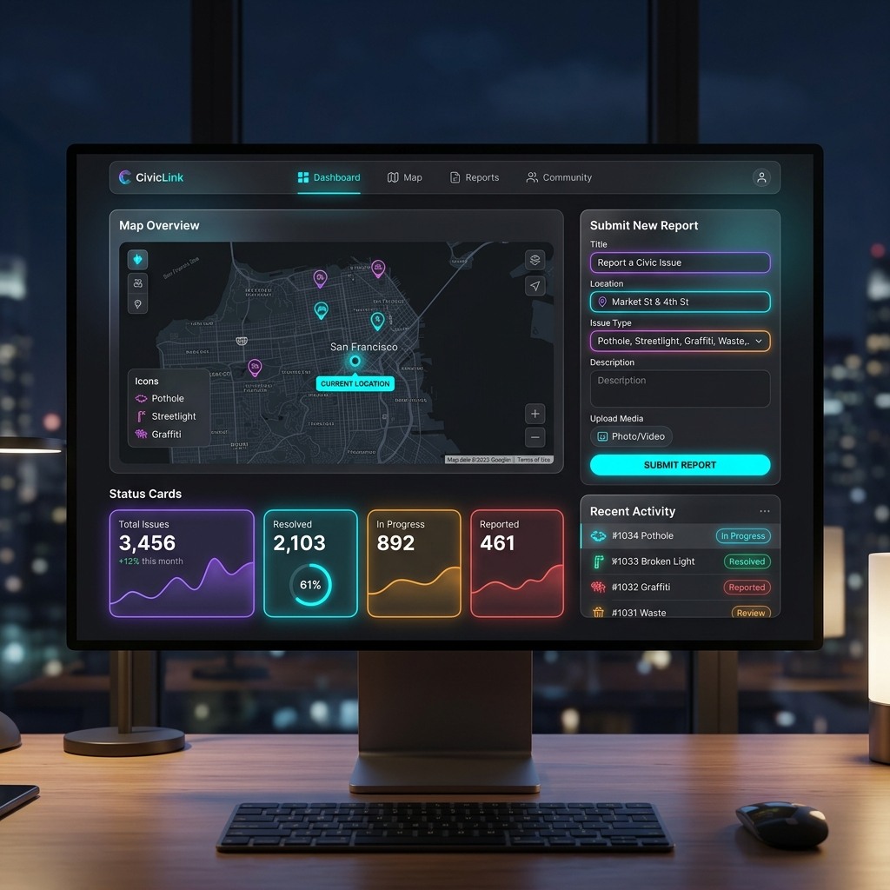
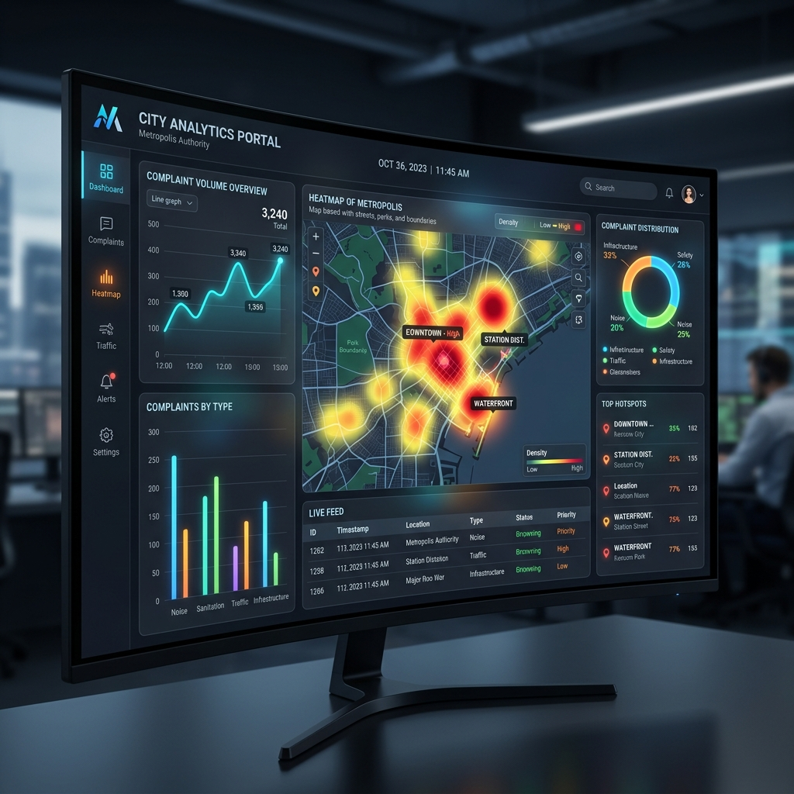
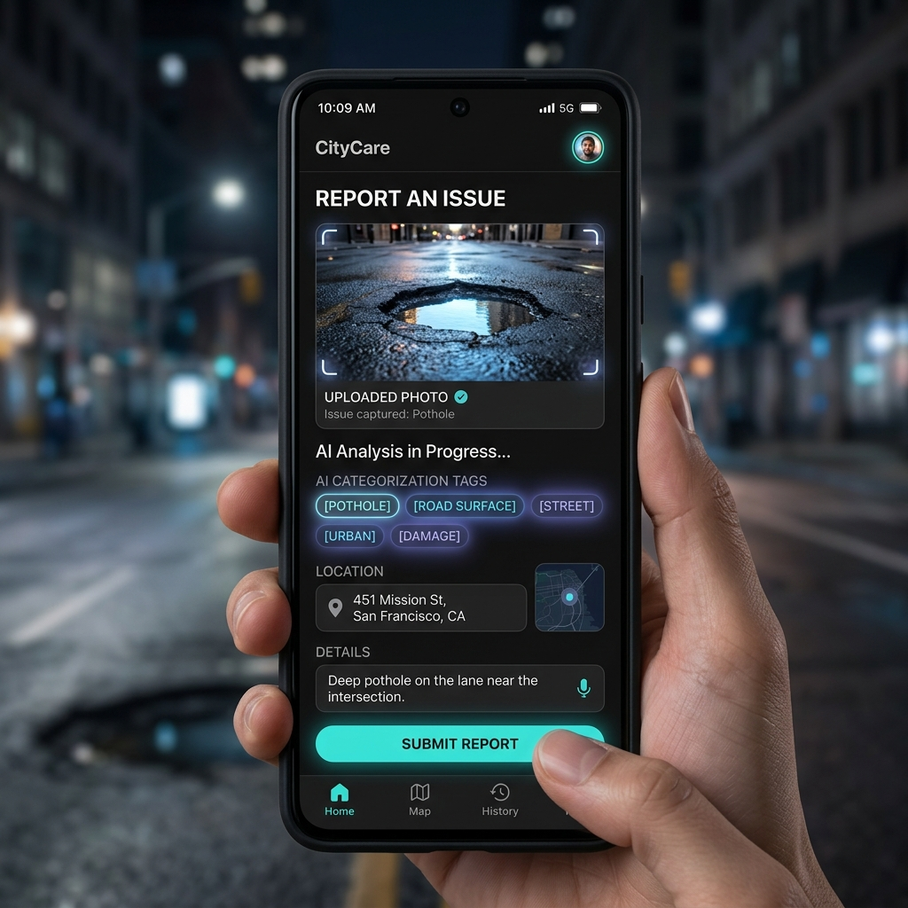

# CivicPulse: AI-Powered Civic Complaint Management System

[](https://opensource.org/licenses/MIT)
[](https://reactjs.org/)
[](https://vitejs.dev/)
[](https://firebase.google.com/)
[](https://fastapi.tiangolo.com/)

## Table of Contents
1. [Project Overview](#project-overview)
2. [Problem Statement & Solution](#problem-statement--solution)
3. [Design-System Architecture](#design-system-architecture)
4. [Tech Stack](#tech-stack)
5. [Key Features](#key-features)
6. [Installation & Setup](#installation--setup)
7. [Documentation](#documentation)
8. [Screenshots](#screenshots)
9. [License](#license)

---

## Project Overview
CivicPulse is an enterprise-grade, full-stack civic complaint management platform designed to facilitate seamless communication between citizens and municipal authorities. It integrates advanced Artificial Intelligence (Natural Language Processing and Computer Vision) to automate the triage, categorization, and prioritization of reported civic issues.

## Problem Statement & Solution
**Problem:** Municipal authorities often struggle with a high volume of unstructured, miscategorized, and unverified civic complaints, leading to slow response times and inefficient resource allocation.

**Solution:** CivicPulse introduces an automated triage system. By utilizing Google Gemini for semantic text analysis and YOLOv8s for zero-shot image verification, the platform accurately classifies complaints, detects duplicate reports, and assigns severity scores before they even reach a human operator.

---

## Design-System Architecture

The application relies on a robust, decoupled architecture connecting Citizen workflows to Authority management through a central Firebase and AI processing layer.

### 1. Citizen Interface
- **Register / Login:** Secure authentication entry point.
- **Submit Complaint:** Input form supporting text, image, and location data.
- **Track Complaint:** Check real-time resolution status.
- **Receive Updates:** Automated status notifications.

### 2. Web Application (Frontend)
- **React.js & Tailwind CSS:** Core UI framework and styling.
- **Charts & Analytics:** Integrated via Recharts / Chart.js for data visualization.
- **Maps & Location:** Geolocation interfaces built with Leaflet.

### 3. Backend & Database (Firebase)
- **Firebase Authentication:** Secure User Management (Email/Password).
- **Cloud Firestore:** Centralized database for Complaints, Users, Notifications, and Status.
- **Cloudinary:** Dedicated Image Upload & CDN Storage.

### 4. AI Processing Layer
- **NLP – Google Gemini API:**
  - Complaint Categorization
  - Priority Prediction
  - Severity Analysis
  - Summary Generation
- **CV – YOLOv8 Object Detection:**
  - Image Analysis
  - Object / Issue Detection
  - Category Mapping
  - Confidence Score Computation

### 5. Authority Interface
- **Dashboard Overview:** Macro-level view of Total Complaints, Status, and Analytics.
- **View Complaints:** Detailed filtering, search, and granular issue details.
- **Update Status:** Mark issues as In Progress, Resolved, or Rejected.
- **Analytics & Reports:** Detailed Charts, Trends, and Statistical breakdowns.
- **Notifications:** Real-time operational alerts.

### 6. External Services
- **Geoapify API & OpenStreetMap (Nominatim):** Primary and fallback Reverse Geocoding.
- **IPAPI:** IP-based Geolocation fallback.
- **Google Gemini API & YOLOv8 Model Server:** Dedicated microservices for NLP and Image Analysis.

### System Workflow
`Citizen Submits Complaint` ➔ `AI Processes Complaint` ➔ `Stored in Firestore` ➔ `Authority Reviews` ➔ `Status Updated` ➔ `Citizen Notified`

---

## Tech Stack

Our technology stack is systematically divided into 6 specialized domains:

| Domain | Technologies Utilized | Purpose |
| :--- | :--- | :--- |
| **1. Frontend** | React.js, Tailwind CSS, HTML5, CSS3, JavaScript, React Router DOM, Lucide React, Recharts, i18next, Leaflet | Core UI Library, Styling, Routing, Icons, Charting, Internationalization, and Mapping. |
| **2. Backend / Database / Cloud** | Firebase Authentication, Cloud Firestore, Cloudinary | User Authentication, Real-time Database sync, Image Storage & CDN. |
| **3. AI / Machine Learning** | Google Gemini API, YOLOv8 | NLP (Categorization, Priority, Summary) and Object Detection for Civic Issues. |
| **4. Visualization & Analytics** | Chart.js / Recharts, Power BI | Interactive Charts, Dashboards & Business Insights. |
| **5. External APIs** | Geoapify API, OpenStreetMap, ipapi.co, Cloudinary API, Web Speech API | Geocoding, Reverse Geocoding, IP Geolocation, Image Management, Voice-to-Text Input. |
| **6. Tools & Platforms** | Vite, VS Code, GitHub, npm, Postman, Figma | Build Tool, Code Editor, Version Control, Package Manager, API Testing, UI/UX Design. |

**Stack Overview Data Flow:**
`Users` ➔ `Frontend` ➔ `Backend` ➔ `AI/ML Processing` ➔ `Analytics & Dashboard` ➔ `Real-time Notifications`

---

## Key Features
- **Role-Based Access Control (RBAC):** Distinct interfaces and permissions for Citizens and Government Authorities.
- **Automated AI Triage:** Real-time extraction of categories, priority levels, and executive summaries from unstructured text.
- **Zero-Shot Object Detection:** Image verification using YOLO to independently identify civic issues.
- **Geospatial Intelligence:** Automated coordinate extraction and reverse geocoding via ArcGIS and Nominatim.
- **Analytics Dashboards:** Comprehensive data visualization for tracking resolution metrics and geographical complaint hotspots.

---

## Installation & Setup

### Prerequisites
- Node.js (v18.x+)
- Python (v3.10+)
- Firebase Account
- Google Gemini API Key

### Frontend Initialization
```bash
git clone https://github.com/your-username/civicpulse-smart-civic-platform.git
cd civicpulse-smart-civic-platform
npm install
npm run dev
```

### Microservice Initialization
```bash
cd ai-microservice
python -m venv venv
venv\Scripts\activate   # Windows
pip install -r requirements.txt
python main.py
```

---

## Documentation
For comprehensive details regarding deployment and architecture, please refer to the `docs/` directory:
- [Architecture Guide](docs/Architecture_Guide.md)
- [Installation Guide](docs/Installation_Guide.md)
- [Environment Variables](docs/Environment_Variables.md)
- [Developer Guide](docs/Developer_Guide.md)
- [Deployment Guide](docs/Deployment_Guide.md)
- [FAQ & Troubleshooting](docs/FAQ_and_Troubleshooting.md)

---

## Screenshots

| Citizen Interface | Authority Interface | Issue Reporting |
| :---: | :---: | :---: |
|  |  |  |

---

## License
This software is licensed under the [MIT License](LICENSE).
