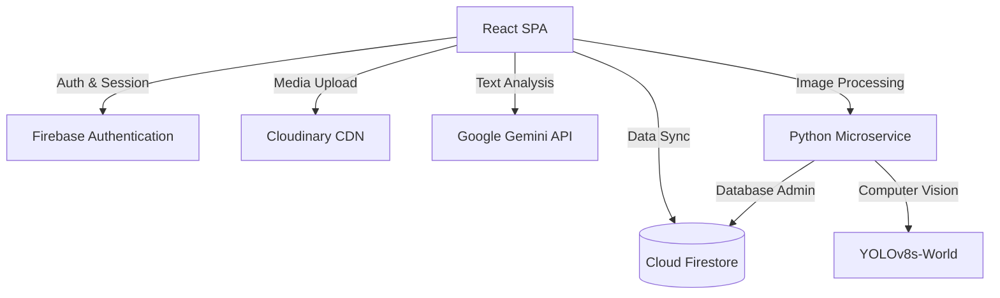
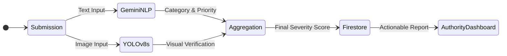

# CivicPulse: AI-Powered Civic Complaint Management System

[](https://opensource.org/licenses/MIT)
[](https://reactjs.org/)
[](https://vitejs.dev/)
[](https://firebase.google.com/)
[](https://fastapi.tiangolo.com/)

## Table of Contents
1. [Project Overview](#project-overview)
2. [Problem Statement & Solution](#problem-statement--solution)
3. [System Architecture](#system-architecture)
4. [Technology Stack](#technology-stack)
5. [Key Features](#key-features)
6. [AI Integration Pipeline](#ai-integration-pipeline)
7. [Installation & Setup](#installation--setup)
8. [Documentation](#documentation)
9. [Screenshots](#screenshots)
10. [License](#license)

---

## Project Overview
CivicPulse is an enterprise-grade, full-stack civic complaint management platform designed to facilitate seamless communication between citizens and municipal authorities. It integrates advanced Artificial Intelligence (Natural Language Processing and Computer Vision) to automate the triage, categorization, and prioritization of reported civic issues.

## Problem Statement & Solution
**Problem:** Municipal authorities often struggle with a high volume of unstructured, miscategorized, and unverified civic complaints, leading to slow response times and inefficient resource allocation.

**Solution:** CivicPulse introduces an automated triage system. By utilizing Google Gemini for semantic text analysis and YOLOv8s for zero-shot image verification, the platform accurately classifies complaints, detects duplicate reports, and assigns severity scores before they even reach a human operator.

---

## System Architecture

The application is structured into decoupled layers, ensuring scalability and separation of concerns.



---

## Technology Stack

### Frontend Application
- **Framework:** React 19, Vite
- **Styling:** Tailwind CSS 4
- **State Management:** React Context API
- **Visualization:** Recharts, Leaflet Maps
- **Internationalization:** i18next

### Backend Infrastructure
- **Database:** Firebase Cloud Firestore (NoSQL)
- **Authentication:** Firebase Auth
- **Storage:** Cloudinary CDN

### AI & Microservices
- **Microservice Framework:** Python, FastAPI
- **Computer Vision:** YOLOv8s-World (Ultralytics)
- **Natural Language Processing:** Google Gemini 2.5 Flash

---

## Key Features

- **Role-Based Access Control (RBAC):** Distinct interfaces and permissions for Citizens and Government Authorities.
- **Automated AI Triage:** Real-time extraction of categories, priority levels, and executive summaries from unstructured text.
- **Zero-Shot Object Detection:** Image verification using YOLO to independently identify civic issues (e.g., potholes, waste accumulation).
- **Geospatial Intelligence:** Automated coordinate extraction and reverse geocoding via ArcGIS and Nominatim.
- **Analytics Dashboards:** Comprehensive data visualization for tracking resolution metrics and geographical complaint hotspots.
- **Multi-Language Support:** Localized interface supporting English, Hindi, Marathi, Tamil, Telugu, and Kannada.

---

## AI Integration Pipeline



---

## Installation & Setup

### Prerequisites
- Node.js (v18.x+)
- Python (v3.10+)
- Firebase Account
- Google Gemini API Key

### Frontend Initialization
```bash
# Clone the repository
git clone https://github.com/your-username/civicpulse-smart-civic-platform.git
cd civicpulse-smart-civic-platform

# Install dependencies
npm install

# Configure environment variables (see docs/Environment_Variables.md)
# Start the development server
npm run dev
```

### Microservice Initialization
```bash
cd ai-microservice
python -m venv venv

# Windows
venv\Scripts\activate
# Unix/macOS
source venv/bin/activate

pip install -r requirements.txt
python main.py
```

---

## Documentation
For comprehensive details regarding deployment and architecture, please refer to the `docs/` directory:
- [Architecture Guide](docs/Architecture_Guide.md)
- [Installation Guide](docs/Installation_Guide.md)
- [Environment Variables](docs/Environment_Variables.md)
- [Developer Guide](docs/Developer_Guide.md)
- [Deployment Guide](docs/Deployment_Guide.md)
- [FAQ & Troubleshooting](docs/FAQ_and_Troubleshooting.md)

---

## Screenshots

| Citizen Interface | Authority Interface | Issue Reporting |
| :---: | :---: | :---: |
|  |  |  |

---

## License
This software is licensed under the [MIT License](LICENSE).
