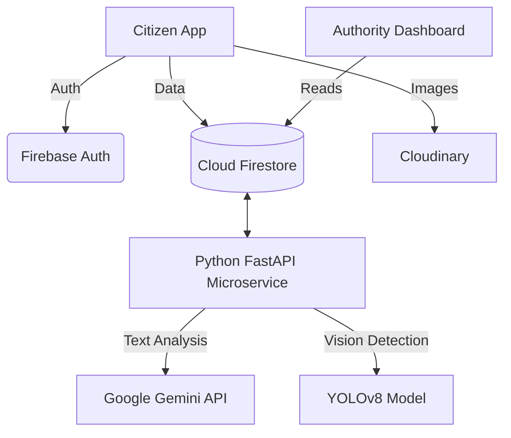
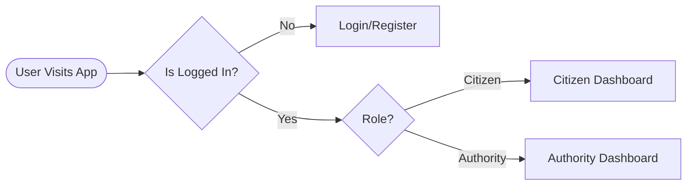
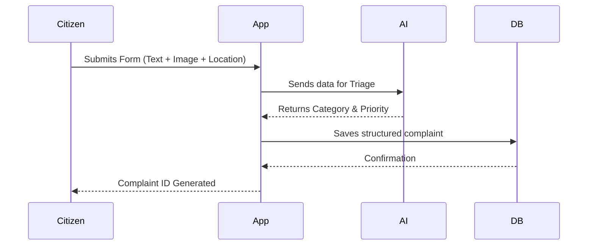
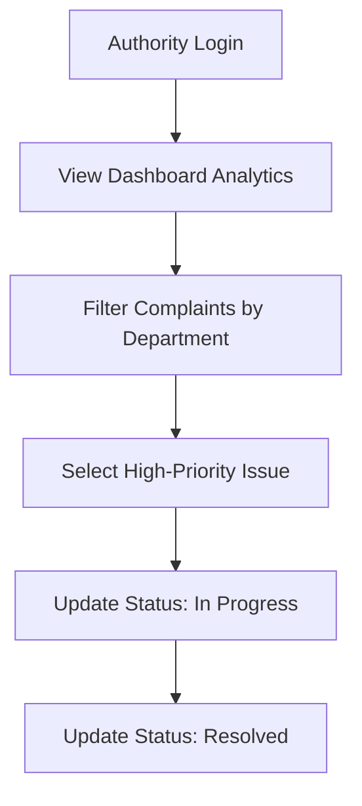
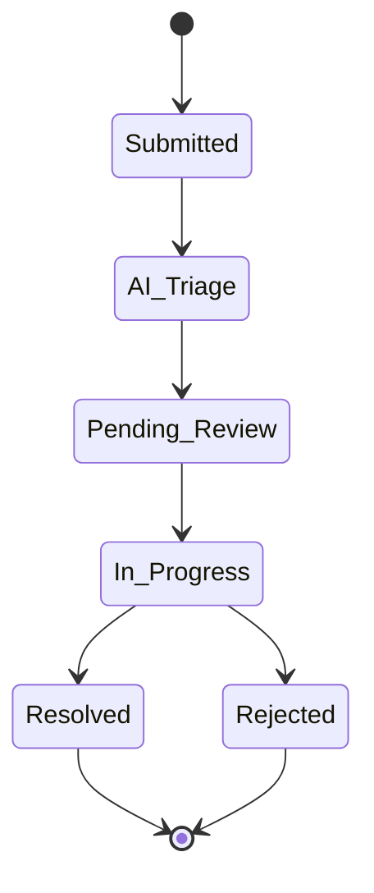
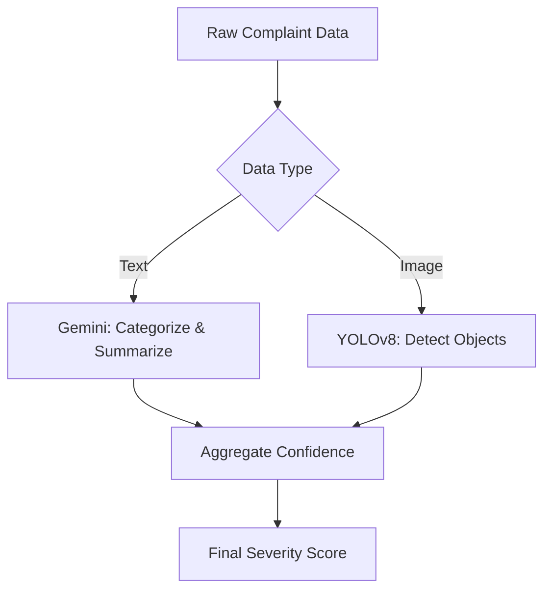
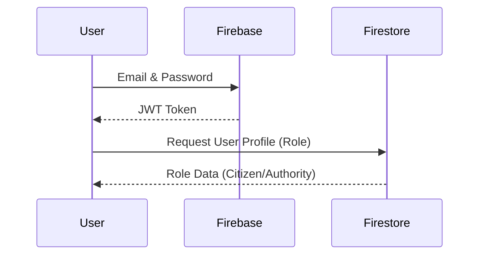
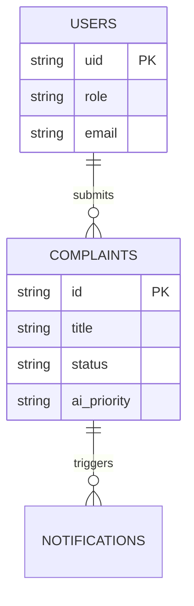
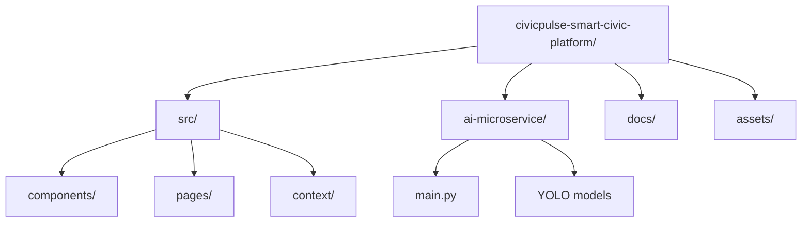

# 🏛️ CivicPulse: AI-Powered Civic Complaint Management System

> **"Empowering Smart Cities Through AI-Driven Civic Intelligence."**

[](https://opensource.org/licenses/MIT)
[](https://reactjs.org/)
[](https://vitejs.dev/)
[](https://firebase.google.com/)
[](https://fastapi.tiangolo.com/)

<div align="center">
  
</div>

<br/>

CivicPulse is an AI-powered Civic Complaint Management System that enables citizens to report civic issues, intelligently classifies complaints using Artificial Intelligence, prioritizes requests based on severity, routes them to the appropriate government department, and provides real-time complaint tracking with analytics dashboards for smarter urban governance.

---

## 📑 Table of Contents
<details>
<summary>Click to expand</summary>

1. [Project Overview](#-project-overview)
2. [Problem & Solution](#-problem--solution)
3. [Key Features](#-key-features)
4. [Technology Stack](#-technology-stack)
5. [System Architecture](#-system-architecture)
6. [Workflows & Diagrams](#-workflows--diagrams)
7. [Project Structure](#-project-structure)
8. [Installation & Setup](#-installation--setup)
9. [Screenshots](#-screenshots)
10. [Challenges & Learnings](#-challenges--learnings)
11. [Contributing](#-contributing)
12. [License](#-license)

</details>

---

## 🎯 Project Overview

CivicPulse acts as a digital bridge between citizens and municipal authorities. By leveraging **Natural Language Processing (Google Gemini)** and **Computer Vision (YOLOv8)**, it eliminates the manual triage of civic complaints (e.g., potholes, waste accumulation, water leakage), ensuring resources are deployed rapidly and efficiently.

### 🛑 Problem Statement
Municipal authorities struggle with a high volume of unstructured, miscategorized, and unverified civic complaints. This leads to slow response times, duplicate reports, and inefficient resource allocation.

### ✅ Solution
CivicPulse introduces an **automated AI triage system**. It uses Gemini for semantic text analysis and YOLOv8s for zero-shot image verification to accurately classify complaints, detect duplicates, and assign severity scores before they ever reach a human operator.

---

## ✨ Key Features

| Category | Features |
| :--- | :--- |
| **🔐 Authentication** | Role-Based Access Control (RBAC) for Citizens and Authorities. |
| **📝 Issue Reporting** | Complaint registration with Image Upload and Geo Location (Geoapify). |
| **🧠 AI Intelligence** | NLP Classification, Priority Detection, and Visual verification via YOLOv8. |
| **🏢 Management** | Automated Department Assignment and comprehensive Authority Dashboards. |
| **📊 Analytics** | Citizen Dashboards, Real-Time Tracking, and Power BI-style visualizations. |
| **🌐 UX/UI** | Dark Mode, Responsive Design, Multi-language support, and Real-Time Updates. |

---

## 🛠️ Technology Stack

<details>
<summary><strong>View Detailed Stack</strong></summary>

- **Frontend:** React 19, Vite, Tailwind CSS 4, React Router DOM, Recharts, Leaflet, i18next.
- **Backend/Database:** Firebase Authentication, Cloud Firestore, Cloudinary.
- **AI/ML:** Google Gemini 2.5 API (NLP), YOLOv8 (Computer Vision).
- **APIs:** Geoapify API, OpenStreetMap, IPAPI, Web Speech API.
- **Tools:** GitHub, npm, Vite, VS Code.

</details>

---

## 🏗️ System Architecture



---

## 🔄 Workflows & Diagrams

<details>
<summary><strong>1. Application Workflow</strong></summary>


</details>

<details>
<summary><strong>2. Citizen Complaint Workflow</strong></summary>


</details>

<details>
<summary><strong>3. Authority Workflow</strong></summary>


</details>

<details>
<summary><strong>4. Complaint Processing Flow</strong></summary>


</details>

<details>
<summary><strong>5. AI Classification Workflow</strong></summary>


</details>

<details>
<summary><strong>6. Authentication Flow</strong></summary>


</details>

<details>
<summary><strong>7. Database Relationship Diagram</strong></summary>


</details>

<details>
<summary><strong>8. Deployment Workflow</strong></summary>


</details>

---

## 📂 Project Structure



---

## 🚀 Installation & Setup

> **Note:** Ensure you have Node.js 18+ and Python 3.10+ installed.

### 1. Clone the Repository
```bash
git clone https://github.com/your-username/civicpulse-smart-civic-platform.git
cd civicpulse-smart-civic-platform
```

### 2. Frontend Setup
```bash
npm install
npm run dev
```

### 3. AI Microservice Setup
```bash
cd ai-microservice
python -m venv venv
# Windows: venv\Scripts\activate | Mac/Linux: source venv/bin/activate
pip install -r requirements.txt
python main.py
```

### 4. Environment Variables
Create a `.env` file in the root directory. Refer to `docs/Environment_Variables.md` for the template configuration for Firebase, Gemini, and Geoapify.

---

## 📸 Screenshots

| Citizen Interface | Authority Interface | Issue Reporting |
| :---: | :---: | :---: |
|  |  |  |

---

## 💡 Challenges & Learnings

### Challenges Faced
- **AI Latency:** Balancing real-time UI updates with the processing time required by YOLOv8 and the Gemini API.
- **Geospatial Accuracy:** Handling edge cases where reverse geocoding APIs (Nominatim) returned inaccurate granular data.

### Learning Outcomes
- Mastered the integration of Python microservices with React frontends.
- Developed a deep understanding of Firebase security rules and role-based access architectures.

---

## 🤝 Contributing
Contributions are welcome! Please check out the [Contributing Guide](CONTRIBUTING.md) and [Code of Conduct](CODE_OF_CONDUCT.md) for more details.

---

## 📄 License
This project is licensed under the [MIT License](LICENSE).

<div align="center">
  <i>Developed with ❤️ for smarter, cleaner cities.</i>
</div>
