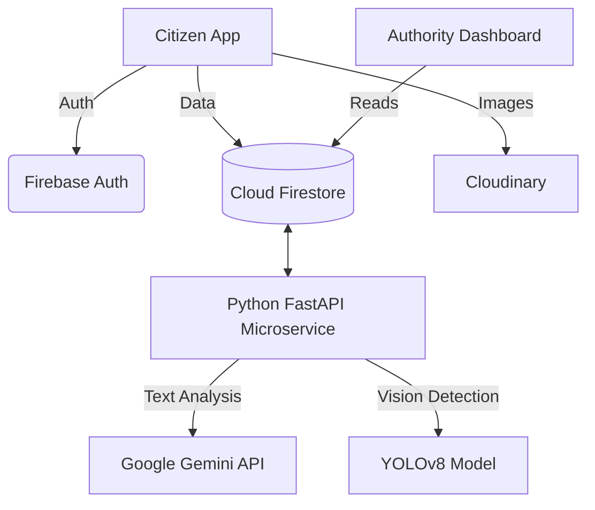
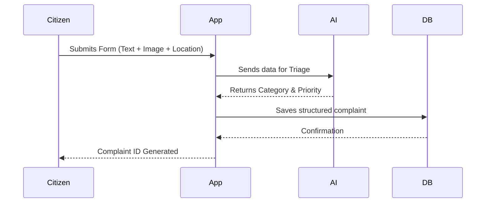
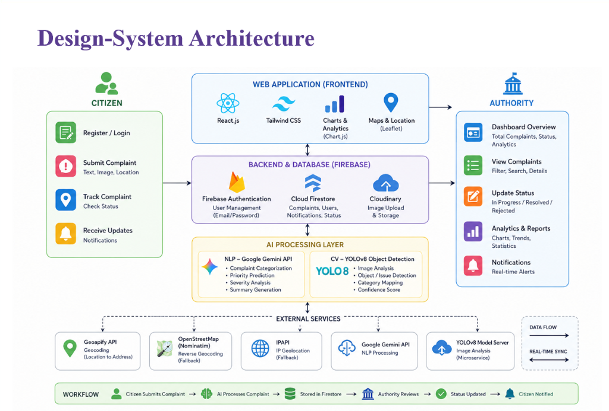
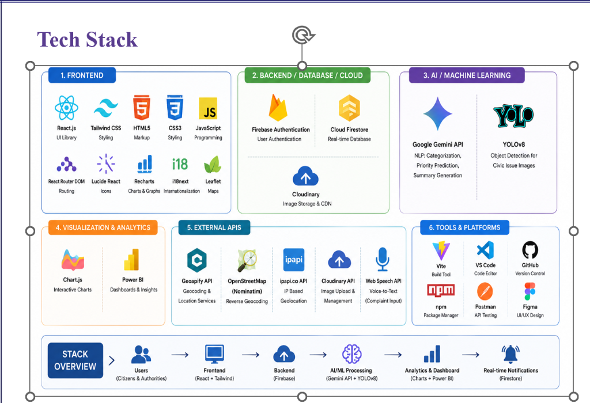

<div align="center">

# 🏛️ CivicPulse: AI-Powered Civic Complaint Management System

### _Empowering Smart Cities Through AI-Driven Civic Intelligence_

&nbsp;

[](https://github.com/omwattamwar/civicpulse-smart-civic-platform/stargazers)
[](https://github.com/omwattamwar/civicpulse-smart-civic-platform/network)
[](LICENSE)
[](https://reactjs.org/)
[](https://firebase.google.com/)
[](#)
[](#)
[](#)

&nbsp;

> **An enterprise-grade civic complaint management system powered by Google Gemini and YOLOv8.**
> **Automates triage, verifies visual evidence, and streamlines urban governance.**

&nbsp;

[🚀 Get Started](#-installation) · [📖 Documentation](#-overview) · [🤝 Contribute](CONTRIBUTING.md) · [📸 Screenshots](#-screenshots)


</div>

---

## 📖 Overview

**CivicPulse** acts as a digital bridge between citizens and municipal authorities. It integrates advanced **Natural Language Processing (Google Gemini)** and **Computer Vision (YOLOv8)** to eliminate the manual triage of civic complaints (e.g., potholes, waste accumulation, water leakage). The platform automatically classifies issues, detects duplicates, assigns severity scores, and routes complaints to the appropriate government department before they ever reach a human operator.

---

## 🎯 Problem Statement

Municipal authorities frequently struggle with a high volume of unstructured, miscategorized, and unverified civic complaints. Manual verification and dispatching processes lead to notoriously slow response times, inefficient resource allocation, and frustrated citizens. There is a critical need for an automated, scalable triage pipeline.

## 💡 Proposed Solution

CivicPulse addresses this urban governance challenge through a **dual-AI integration approach** that:

- Uses **Google Gemini NLP** to analyze complaint text for priority, category, and sentiment.
- Deploys a **YOLOv8s Vision Model** to verify uploaded photos for objective evidence.
- Merges these insights to calculate a robust **Severity Score**.
- Delivers actionable data directly to authorities via a highly optimized **Analytics Dashboard**.

---

## ✨ Key Features

| Target | Feature | Description |
|:---:|---|---|
| 🔐 | **Authentication** | Secure Role-Based Access Control (RBAC) for Citizens and Authorities via Firebase |
| 📝 | **Issue Reporting** | Clean form submission with Cloudinary Image Upload and Geo Location (Geoapify) |
| 🧠 | **AI Intelligence** | Zero-shot visual verification (YOLOv8) and Semantic Text Analysis (Gemini) |
| 🏢 | **Authority Admin** | Automated Department Assignment and comprehensive incident Dashboards |
| 📊 | **Analytics** | Citizen Dashboards, Real-Time Issue Tracking, and data-driven charting |
| 🌐 | **UX / UI** | Premium Dark Mode, Responsive Design, i18n support, and Real-Time Updates |

---

## 🛠️ Technology Stack

| Category | Technology | Purpose |
|---|---|---|
| 🎨 Frontend | **React 19 & Tailwind CSS 4** | Core UI library and rapid styling framework |
| ⚡ Build Tool | **Vite** | Lightning-fast development server and optimized production builds |
| 💾 Backend | **Firebase (Auth & Firestore)** | User management and real-time NoSQL database syncing |
| 🤖 NLP API | **Google Gemini 2.5 Flash** | Semantic text processing, summary generation, and priority prediction |
| 👁️ Vision Model | **YOLOv8s (Ultralytics)** | High-speed object detection for civic issue images |
| 🐍 Microservice | **Python & FastAPI** | Lightweight asynchronous backend handling AI inferences |
| 🌍 Geolocation | **Geoapify & Leaflet** | Reverse geocoding of coordinates and interactive maps |
| ☁️ Storage | **Cloudinary CDN** | High-performance image hosting and delivery |

---

## ⚙️ AI Integration Pipeline

```
┌──────────────────┐     ┌──────────────────┐     ┌──────────────────────────┐
│  📥 Complaint    │     │  📝 NLP Analysis │     │  🤖 Gemini AI            │
│  Submission      │────▶│  Extract Context │────▶│  Category, Priority,     │
│  Text + Image    │     │  & Tone          │     │  and Severity Score      │
└──────────────────┘     └──────────────────┘     └────────────┬─────────────┘
                                                               │
                                                               ▼
┌──────────────────┐     ┌──────────────────┐     ┌──────────────────────────┐
│  🏢 Authority    │     │  🗳️ Aggregation  │     │  👁️ Computer Vision      │
│  Dashboard       │◀────│  Final AI Trust  │◀────│  YOLOv8s Object Detect   │
│  Actionable Data │     │  Score Computed  │     │  Verify Image Integrity  │
└──────────────────┘     └──────────────────┘     └──────────────────────────┘
```

### Pipeline Steps in Detail

1. **Submission** — Citizen submits text, image, and geolocation.
2. **Parallel Processing** — Data hits the Python FastAPI microservice.
3. **NLP Triage** — Gemini analyzes text context to determine department (e.g., Road, Water) and priority.
4. **Visual Verification** — YOLOv8 scans the image for objective proof (e.g., detecting a pothole).
5. **Aggregation** — AI outputs are merged into a unified "Severity Score" and saved to Firestore.
6. **Dashboard Alert** — The relevant Authority sees the prioritized issue in real-time.

---

## 📊 System Architecture Workflows

<details>
<summary><strong>1. Application Architecture</strong></summary>


</details>

<details>
<summary><strong>2. Citizen Complaint Workflow</strong></summary>


</details>

---

## 📁 Project Structure

```
civicpulse-smart-civic-platform/
├── src/                            # Frontend React Application
│   ├── components/                 # Reusable UI components
│   ├── pages/                      # Citizen & Authority view screens
│   ├── context/                    # React Context (Auth, Notifications)
│   ├── lib/                        # Firebase & Gemini configs
│   ├── locales/                    # i18n language files
│   └── main.jsx                    # Application entry point
├── ai-microservice/                # Python Backend
│   ├── main.py                     # FastAPI routes
│   ├── evaluate_model.py           # YOLO evaluation scripts
│   ├── requirements.txt            # Python dependencies
│   └── firebase_config.json        # Template credentials
├── docs/                           # Detailed Documentation
│   ├── Architecture_Guide.md
│   ├── Installation_Guide.md
│   ├── Environment_Variables.md
│   └── Deployment_Guide.md
├── assets/                         # Generated UI Mockups
├── package.json                    # Node dependencies
└── README.md                       # This file
```

---

## 🚀 Installation

### Prerequisites

- **Node.js** (v18.x+) and npm
- **Python** (v3.10+)
- A **Firebase** Account
- A **Google Gemini** API Key

### Step-by-Step Setup

```bash
# 1. Clone the repository
git clone https://github.com/omwattamwar/civicpulse-smart-civic-platform.git
cd civicpulse-smart-civic-platform

# 2. Install frontend dependencies
npm install

# 3. Setup Python microservice
cd ai-microservice
python -m venv venv
venv\Scripts\activate      # On Windows
# source venv/bin/activate # On Mac/Linux
pip install -r requirements.txt

# 4. Configure Environment Variables
# Refer to docs/Environment_Variables.md for .env setup

# 5. Start development servers
# Terminal 1 (Frontend):
npm run dev

# Terminal 2 (Microservice):
python main.py
```

---

## 📸 Architecture & Tech Stack

<div align="center">
  
  <br/>
  <br/>
  
</div>

---

## 🔮 Future Improvements

| Priority | Feature | Description |
|:---:|---|---|
| 🔴 | **Automated Deployment** | Set up GitHub Actions CI/CD for Firebase Hosting |
| 🟠 | **Mobile Application** | Build a React Native app for field reporting |
| 🟡 | **Custom YOLO Training** | Fine-tune YOLOv8 on specific regional civic anomalies |
| 🟢 | **SMS Notifications** | Integrate Twilio for offline citizen updates |

---

## 🎓 Learning Outcomes

Through building CivicPulse, the following skills were developed and demonstrated:

- **Full-Stack Development** — architecting decoupled frontends and backends using React and FastAPI.
- **AI Integration** — merging LLM (Gemini) responses with Computer Vision (YOLO) inferencing securely.
- **NoSQL Database Modeling** — designing robust, real-time sync schemas in Cloud Firestore.
- **Geospatial Processing** — manipulating map coordinates and utilizing reverse geocoding APIs.
- **Authentication & Security** — implementing strict Role-Based Access Control (RBAC) via Firebase Auth.
- **System Design** — mapping and documenting complex asynchronous data workflows.

---

## 🤝 Contributing

Contributions are welcome! Please read our [**Contributing Guidelines**](CONTRIBUTING.md) and [**Code of Conduct**](CODE_OF_CONDUCT.md) before submitting a pull request.

```
1. Fork the repository
2. Create a feature branch (git checkout -b feature/amazing-feature)
3. Commit your changes (git commit -m 'Add amazing feature')
4. Push to the branch (git push origin feature/amazing-feature)
5. Open a Pull Request
```

---

## 📄 License

This project is licensed under the **MIT License** — see the [LICENSE](LICENSE) file for details.

---

## 📬 Contact

<div align="center">

**Om Wattamwar**

_Developer & Maintainer_

⭐ If this project helped you, consider giving it a star!

</div>

---

<div align="center">

**`react`** · **`vite`** · **`firebase`** · **`tailwindcss`** · **`artificial-intelligence`** · **`machine-learning`** · **`smart-city`** · **`civic-tech`** · **`computer-vision`** · **`yolo`**

&nbsp;

_Developed with  for smarter, cleaner cities._

</div>
