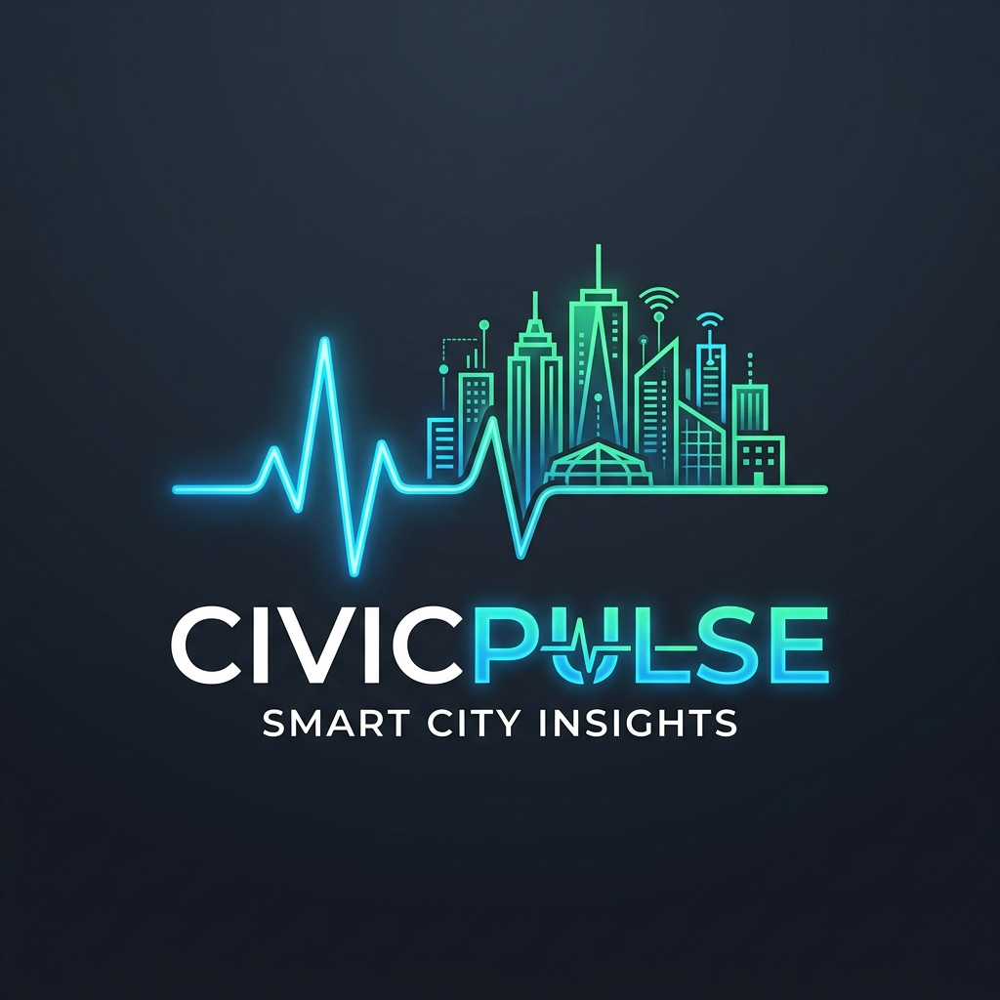
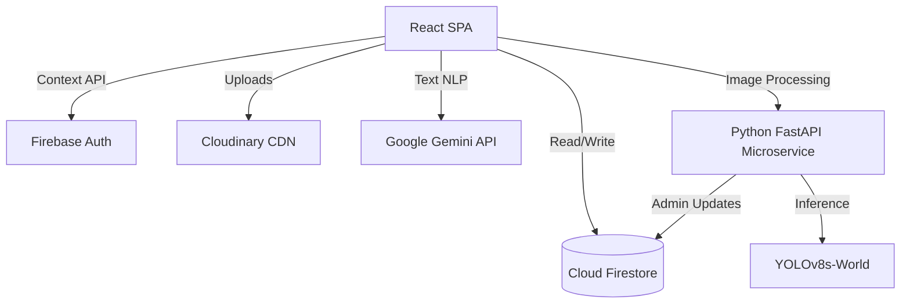
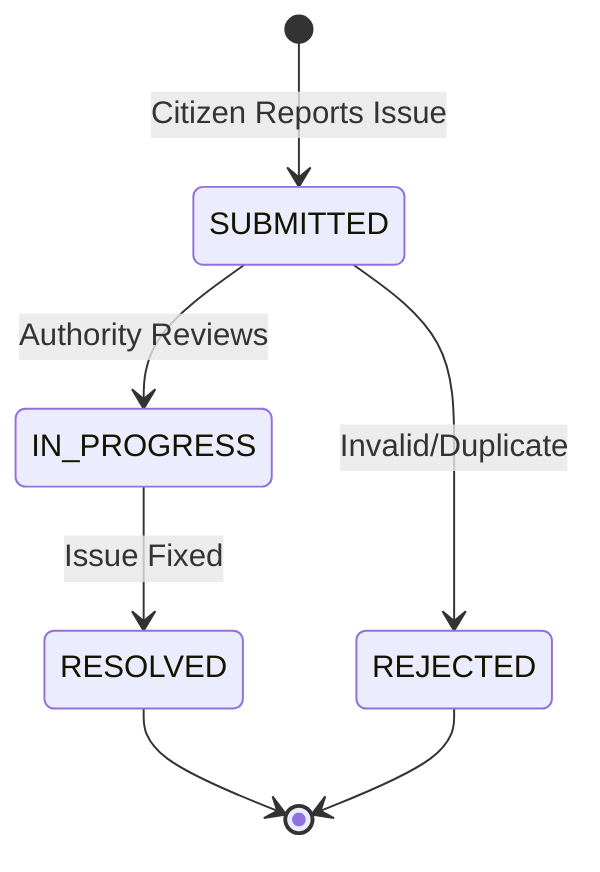

# CivicPulse - AI-Powered Civic Complaint Management System

<div align="center">
  
  <br/>
  <br/>
  

  <h3>Empowering Smart Cities Through AI-Driven Civic Complaint Resolution.</h3>
  
  [](https://opensource.org/licenses/MIT)
  [](https://reactjs.org/)
  [](https://vitejs.dev/)
  [](https://firebase.google.com/)
  [](https://fastapi.tiangolo.com/)
</div>

---

## 📖 Project Overview

**CivicPulse** is a comprehensive, full-stack AI-powered civic complaint management platform designed to bridge the gap between citizens and municipal authorities. It enables citizens to easily report civic issues (such as potholes, water leaks, or garbage) and empowers government authorities to track, manage, and resolve these complaints efficiently using Artificial Intelligence.

### ❓ The Problem
Urban governance often suffers from slow response times, miscategorized complaints, and a lack of real-time visibility into civic issues. Citizens find it difficult to report problems, and authorities struggle to prioritize the massive influx of complaints.

### 💡 The Solution
CivicPulse automates the triage process. Using **Google Gemini NLP**, it intelligently categorizes and summarizes text complaints. Using a custom **YOLOv8s-World AI Microservice**, it performs zero-shot object detection on uploaded images to verify issues (like potholes or broken traffic lights) and assign priority levels, routing them to the correct department instantly.

---

## ✨ Key Features

- **Role-Based Portals:** Dedicated dashboards for Citizens (to report/track) and Authorities (to manage/analyze).
- **AI Text Analysis:** Google Gemini integration for automatic category prediction, severity scoring, and executive summaries.
- **AI Computer Vision:** YOLOv8s-World integration to detect civic issues from user-uploaded images.
- **Smart Geolocation:** Automatic GPS tracking with ArcGIS/Nominatim reverse geocoding to pinpoint complaint locations.
- **Real-Time Sync:** Firebase Firestore ensures that status updates and notifications are delivered instantly without page refreshes.
- **Analytics & Dashboards:** Beautiful data visualization using Recharts for complaint trends, department performance, and priority distribution.
- **Multi-Language Support (i18n):** Accessible in English, Hindi, Marathi, Tamil, Telugu, and Kannada.
- **Responsive & Modern UI:** Glassmorphism design, dark mode, and mobile-first approach using Tailwind CSS.

---

## 🛠️ Technology Stack

| Domain | Technologies |
| :--- | :--- |
| **Frontend** | React 19, Vite, Tailwind CSS 4, React Router, Recharts, Lucide React, i18next |
| **Backend & Cloud** | Firebase Auth, Cloud Firestore, Cloudinary (Image CDN) |
| **AI & ML** | Google Gemini 2.5 Flash, YOLOv8s-World (Ultralytics) |
| **Microservice** | Python, FastAPI, Firebase Admin SDK |
| **External APIs** | ArcGIS Geocoding, Nominatim, ipapi.co, Web Speech API |

---

## ⚙️ System Architecture & Workflow

### Application Architecture



### Complaint Lifecycle



---

## 🚀 Getting Started

Please refer to our documentation for detailed setup instructions:

- [Installation Guide](docs/Installation_Guide.md)
- [Architecture Guide](docs/Architecture_Guide.md)
- [Environment Variables](docs/Environment_Variables.md)

### Quick Start (Frontend)

```bash
git clone https://github.com/your-username/civicpulse-smart-civic-platform.git
cd civicpulse-smart-civic-platform
npm install
# Set up your .env file
npm run dev
```

---

## 📸 Screenshots

*(Add screenshots of your application here)*

| Citizen Dashboard | Authority Dashboard | Report Issue View |
| :---: | :---: | :---: |
|  |  |  |

---

## 🤝 Contributing

We welcome contributions! Please see our [Contributing Guidelines](CONTRIBUTING.md) and [Code of Conduct](CODE_OF_CONDUCT.md) for details.

## 📄 License

This project is licensed under the MIT License - see the [LICENSE](LICENSE) file for details.

## 🙏 Acknowledgements

- Google for the Gemini API.
- Ultralytics for YOLOv8.
- The open-source community for React, Vite, and Tailwind CSS.
