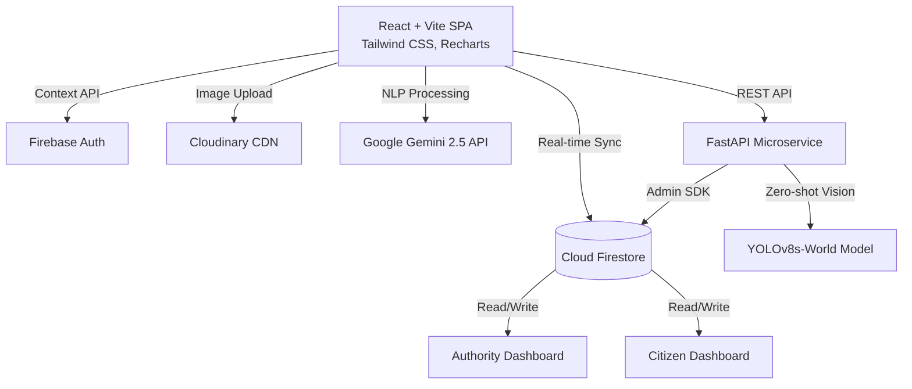

# Architecture Guide

CivicPulse is built using a modern decoupled architecture, combining a React Single Page Application (SPA) with Firebase Backend-as-a-Service (BaaS) and a standalone Python/FastAPI microservice for heavy AI inference.

## High-Level Architecture Diagram

## Database Schema (Firestore)

### `complaints` Collection
- **customId**: String (e.g., "CIV-001")
- **title**: String
- **description**: String
- **category**: String
- **priority**: String (high, medium, low)
- **status**: String (submitted, in_progress, resolved, rejected)
- **location**: Map { lat, lng, area }
- **aiSeverity**: Number (0.0-1.0)
- **aiOverview**: String
- **media**: Array of URLs
- **createdAt**: Timestamp

### `users` Collection
- **uid**: String (Auth ID)
- **role**: String (citizen, authority)
- **name**: String
- **area/department**: String

### `notifications` Collection
- **userId**: String
- **title**: String
- **message**: String
- **read**: Boolean

## AI Pipeline

1. **Text Analysis (Gemini):** Runs entirely on the client side (or serverless function) using the Gemini API to parse the complaint text, extract keywords, suggest categories, and generate executive summaries.
2. **Computer Vision (YOLOv8s-World):** Runs on the FastAPI microservice. Images are downloaded from Cloudinary by the microservice, processed through YOLO for zero-shot civic issue detection (e.g., potholes, garbage), and results are written back to Firestore.
